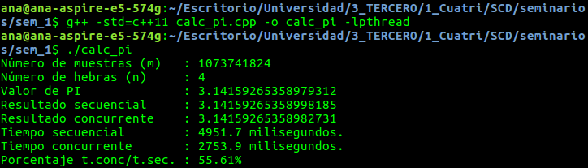

# Cálculo de pi
> Por: Ana Buendía Ruiz-Azuaga
## Funciones
Para resolver el problema se han creado funciones para el reparto de hebras (ya sea de forma cíclica o contigua), el cálculo de la integral (que también depende de cómo se repartieran las hebras), la función para el cálculo secuencial de la integral y, por último, la función f  integrar.
### Asignación de hebras
Tenemos dos funciones:
- `funcion_hebra_contigua` en la que se han repartido el mismo número de iteraciones consecutivas a cada hebra.
- `funcion_hebra_ciclica` en la que se han repartido el mismo bnúmero de iteraciones a cada hebra, alternativamente.

```cpp
double funcion_hebra_contigua( long i ){
   long chunk = m/n;
   long lim_inf = i*chunk;
   long lim_sup = (i+1)*chunk;

   if (i == (n-1))
      lim_sup = m;

   double suma = 0.0;
   for (long j = lim_inf; j < lim_sup; ++j)
      suma += f( (j+double(0.5)) / m );
   
   return suma;
}
```

```cpp
double funcion_hebra_ciclica( long i ){
   double suma = 0.0;
   for (long j = i; j < m; j+=n)
      suma += f( (j+double(0.5)) / m );

   return suma;
}
```

### Cálculo de la integral concurrentemente
Para calcular la integral tenemos de nuevo dos funciones para distinguir el modo de reparto de hebras, pero que funcionan de forma análoga, y otra función para elegir cómo se hará el reparto de hebras según un valor pasado como argumento de forma más cómoda.
Primeramente se crea un array de objetos `future<double>` para almacenar los resultados de la ejecución de cada hebra de forma segura, luego se suman todos y se divide entre el número de intervalos, obteniendo así la integral buscada.

```cpp
double funcion_hebra_ciclica( long i ){
   double suma = 0.0;
   for (long j = i; j < m; j+=n)
      suma += f( (j+double(0.5)) / m );

   return suma;
}
```

```cpp
double calcular_integral_concurrente_contigua(){
   future<double> futuros[n];

   for (long i = 0; i < n; ++i)
      futuros[i] = async(launch::async, funcion_hebra_contigua, i);

   double suma = 0.0;
   for (long i = 0; i < n; ++i)
      suma += futuros[i].get();
   
   return suma/m;
}
```

```cpp
double calcular_integral_concurrente_ciclica(){
   future<double> futuros[n];

   for (long i = 0; i < n; ++i)
      futuros[i] = async(launch::async, funcion_hebra_ciclica, i);

   double suma = 0.0;
   for (long i = 0; i < n; ++i)
      suma += futuros[i].get();

   return suma/m;
}
```

## Resultados de ejecución
Podemos observar que la aproximación de pi es correcta hasta 12 decimales en la aproximación secuencial y concurrente, independiente de la asignación de hebras realizada.
Además es claro que el tiempo del programa concurrente es considerablemente menor que el del programa secuencial.




